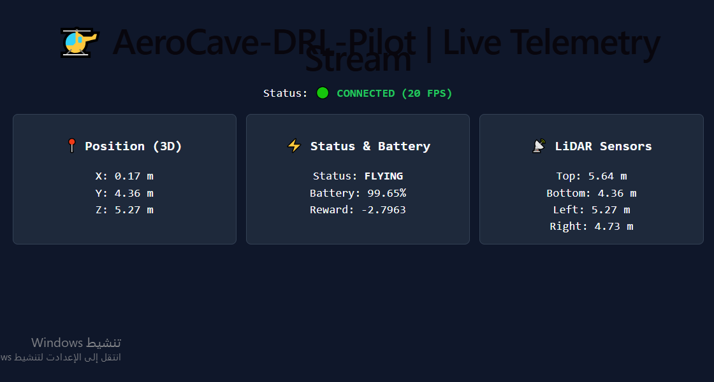
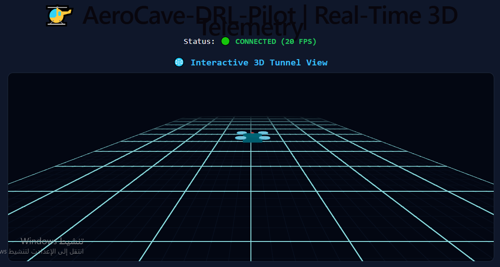
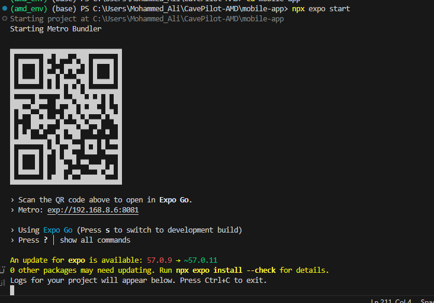
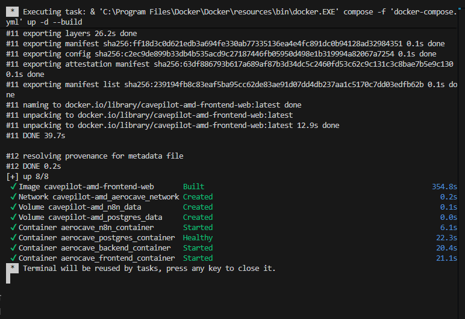

# 🚁 AeroCave-DRL-Pilot

[](https://python.org)
[](https://fastapi.tiangolo.com)
[](https://reactjs.org)
[](https://docker.com)
[](https://n8n.io)
[]()

> **Full-Stack MLOps & Deep Reinforcement Learning Autonomous Navigation System for GPS-Denied Industrial Environments.**

---

## 📌 Executive Summary

**AeroCave-DRL-Pilot** is an enterprise-grade autonomous drone navigation and telemetry monitoring ecosystem designed for indoor GPS-denied applications (e.g., airport hangars, deep caves, utility tunnels, and automated logistics warehouses).

The platform blends **Deep Reinforcement Learning (PPO)** for dynamic trajectory planning, **FastAPI WebSockets** for low-latency state-streaming (20 FPS), **React Three.js** for interactive 3D flight visualization, and an auto-scalable **Docker Swarm & Traefik** infrastructure.

---

## 📚 System Documentation Structure

For detailed technical specifications, refer to our modular documentation guides:

- 📐 [**System Architecture & DRL Core**](./docs/ARCHITECTURE.md) - Deep learning pipelines, Gymnasium 3D environment, and PPO agent reward structure.
- 📡 [**API & Real-Time Telemetry Specs**](./docs/API_DOCS.md) - REST endpoints, Swagger UI, and WebSocket packet payloads.
- 🛠️ [**MLOps & Distributed Infrastructure**](./docs/MLOPS_INFRASTRUCTURE.md) - Multi-node orchestration via Docker Swarm, Traefik load balancing, and PostgreSQL/pgAdmin logging.
- 🚀 [**Deployment & Setup Guide**](./docs/DEPLOYMENT_GUIDE.md) - Step-by-step instructions for running locally or deploying on cloud clusters.

---

## 📸 Technical Proof & System Visuals

### 1. Real-Time Telemetry & LiDAR Readouts


_Figure 1: Real-time telemetry dashboard monitoring (X, Y, Z) spatial orientation, battery health, reward trends, and 4-directional LiDAR distance readouts._

### 2. Interactive 3D Flight & Tunnel Navigation


_Figure 2: Three.js interactive 3D canvas displaying drone pose and boundary constraints in real time._

### 3. Mobile Field Client (React Native & Expo)


_Figure 3: Metro Bundler console output providing immediate Expo QR code integration for field operations._

### 4. Enterprise Containerization (Docker Compose)


_Figure 4: Automated multi-container orchestration bringing up Web Frontend, FastAPI Backend, PostgreSQL database, and n8n engine._

### 5. Multi-Node Production Orchestration (Docker Swarm)


_Figure 5: Active Swarm Manager initializing `aerocave_stack` with dynamic Traefik reverse-proxy routing and auto-scaled service replicas._

---

## ⚡ Quick Start (Docker Compose)

Launch the entire stack locally with a single command:

```bash
# Clone the repository
git clone [https://github.com/Mohamm76/AeroCave-DRL-Pilot.git](https://github.com/Mohamm76/AeroCave-DRL-Pilot.git)
cd AeroCave-DRL-Pilot

# Build and start all services
docker compose up -d --build
```
