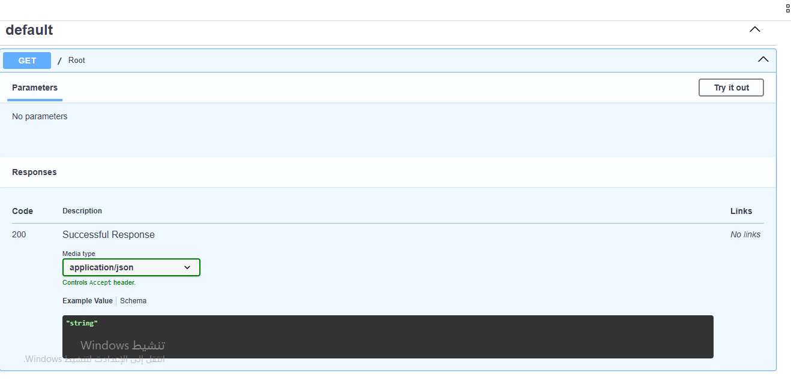

# 📡 Real-Time Telemetry & REST API Documentation

This document provides complete technical specifications for the FastAPI backend, WebSocket state-streaming protocol, and Swagger UI integration in **AeroCave-DRL-Pilot**.

---

## 1. OpenAPI & Interactive Swagger UI

The system exposes full OpenAPI v3 documentation available via FastAPI's interactive interface at `http://localhost:8000/docs`.


_Figure 1: Interactive Swagger UI endpoint testing interface._

---

## 2. REST API Endpoint Reference

### Health Check

- **URL**: `/api/v1/health`
- **Method**: `GET`
- **Description**: Verifies backend server and database connection health.
- **Response 200 OK**:

```json
{
  "status": "healthy",
  "database": "connected",
  "timestamp": "2026-08-10T12:19:41Z"
}
```
Flight Telemetry History
URL: /api/v1/telemetry/history

Method: GET

Query Parameters:

limit (int, default: 100): Number of logs to retrieve.

flight_id (str, optional): Filter logs by specific flight session.

Response 200 OK:
[
  {
    "id": 1042,
    "flight_id": "FLIGHT-2026-0810-01",
    "position": {"x": 12.4, "y": -3.2, "z": 5.1},
    "battery": 88.5,
    "reward": 14.2,
    "timestamp": "2026-08-10T12:20:00Z"
  }
]3. Real-Time WebSocket Telemetry Protocol
For high-frequency low-latency telemetry streaming, the backend utilizes WebSocket communication at 20 Hz.

Endpoint: ws://localhost:8000/ws/telemetry
Inbound Packet (Server -> Client)
{
  "event": "TELEMETRY_FRAME",
  "data": {
    "flight_id": "FLIGHT-2026-0810-01",
    "position": {
      "x": 12.45,
      "y": -3.21,
      "z": 5.10
    },
    "velocity": {
      "vx": 1.20,
      "vy": 0.05,
      "vz": -0.10
    },
    "orientation": {
      "roll": 0.02,
      "pitch": -0.01,
      "yaw": 1.57
    },
    "lidar_distances": [4.2, 1.8, 3.5, 0.9],
    "battery_percentage": 88.5,
    "current_reward": 14.20
  }
}
4. Server Execution & WebSocket Integration Tests
Figure 2: Execution of FastAPI ASGI server with Uvicorn worker process.

Figure 3: Live telemetry streaming test verifying packet structure and 20 Hz broadcast rate.
