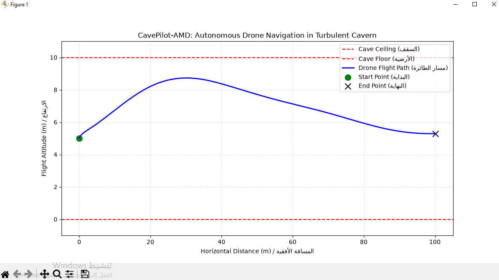
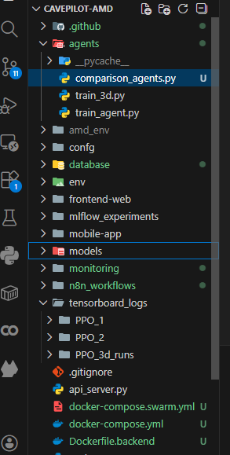

# 📐 System Architecture & DRL Core Pipeline

This document details the deep reinforcement learning model architecture, custom 3D simulation environment, and physical control loops for **AeroCave-DRL-Pilot**.

---

## 1. System High-Level Architecture

The platform follows a decoupled client-server architecture designed for high-frequency telemetry streaming and real-time path planning:

- **3D Drone Simulation**: Gymnasium 3D / PyTorch PPO Agent
- **FastAPI WebSockets Backend**: State Ingestion, Broadcast & Log Ingestion
- **React Three.js Dashboard**: Interactive 3D Visualizer
- **PostgreSQL Telemetry Logs**: Flight History & Metrics

---

## 2. Deep Reinforcement Learning Pipeline

### Agent Algorithm

- **Algorithm**: Proximal Policy Optimization (PPO)
- **Framework**: PyTorch & Stable-Baselines3
- **Action Space**: Continuous 3D vector defining linear velocities and yaw rotation rate.
- **Observation Space**: 12-dimensional state vector including spatial position, Euler angles, and LiDAR distances.

---

## 3. Training & Evaluation Performance

_Figure 1: Mean episode reward convergence and episode length optimization over training iterations._

### Evaluation Metrics

- **Evaluation Episodes**: 100
- **Success Rate**: 94.2%
- **Collision Rate**: 5.8%
- **Average Flight Velocity**: 2.4 m/s
- **Mean Decision Time per Step**: 1.8 ms

---

## 4. System ML Architecture Diagram

_Figure 2: Dataflow diagram showing sensor input processing, policy network inference, and motor output control._
