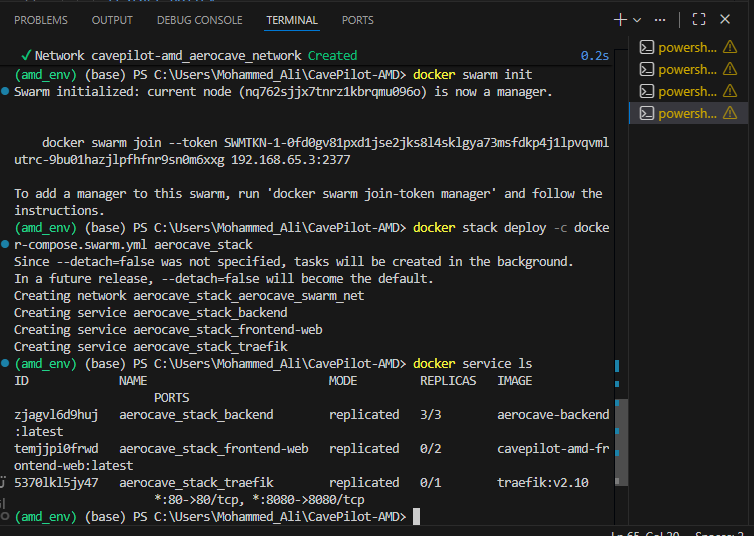
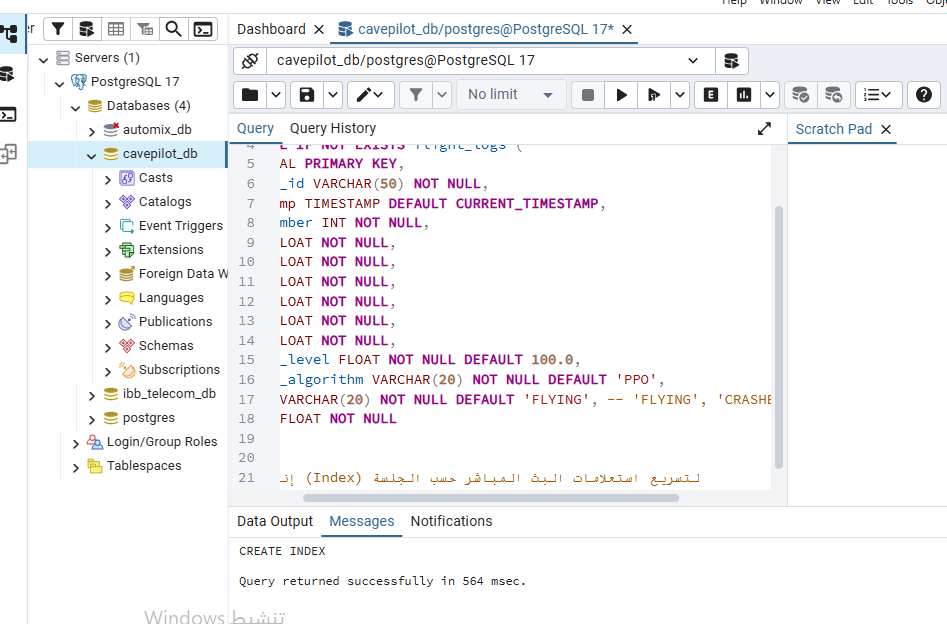
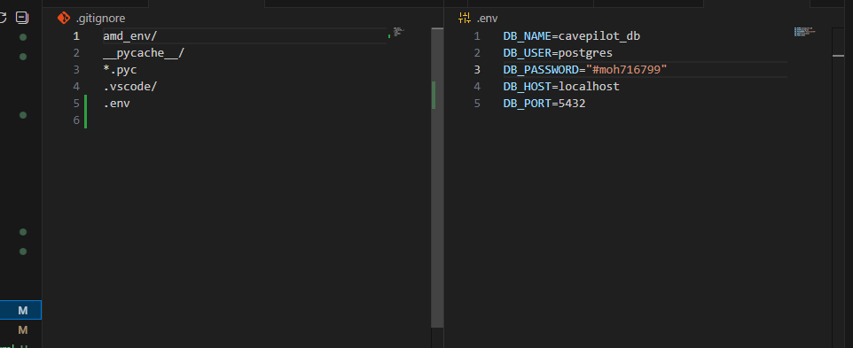

```markdown
# 🛠️ MLOps Infrastructure & Container Orchestration

This document details the multi-container deployment architecture, Docker Swarm orchestration, Traefik dynamic load balancing, and logging pipeline for **AeroCave-DRL-Pilot**.

---

## 1. Container Infrastructure Architecture

The system is fully containerized and orchestrated using Docker Swarm for high availability and service scaling in production, with Docker Compose supported for local development.
```

```
                             [ Incoming Traffic ]
                                      |
                                      v
                          +-----------------------+
                          |   Traefik Reverse     |
                          |   Proxy & Load Bal.   |
                          +-----------------------+
                               /             \
               [http://app.local](http://app.local)               ws://api.local
                     /                               \
                    v                                 v
    +-------------------------------+   +-------------------------------+
    |  Web Dashboard (React 3D)     |   |   FastAPI Service (Scale: x3) |
    |  Replica 1 | Replica 2        |   |   Replica 1 | Replica 2 | ... |
    +-------------------------------+   +-------------------------------+
                    \                                 /
                     +---------------+---------------+
                                     |
                                     v
                    +-------------------------------+
                    |  PostgreSQL Database & pgAdmin|
                    |  (Telemetry Logs & Storage)   |
                    +-------------------------------+
                                     |
                                     v
                    +-------------------------------+
                    |    n8n Workflow Engine        |
                    |  (Automated Event Alerts)     |
                    +-------------------------------+

```

```

---

## 2. Distributed Deployment via Docker Swarm

For multi-node cluster deployment, the services are packaged into a stack (`aerocave_stack`) with auto-healing and dynamic routing capabilities.


*Figure 1: Docker Swarm initialization and service deployment logs showing Traefik and multi-replica services.*

### Key Docker Swarm Services:
* **`aerocave_web`**: React Three.js Frontend running on Nginx (Port 3000).
* **`aerocave_backend`**: Scalable FastAPI ASGI instances streaming WebSockets (Port 8000).
* **`aerocave_db`**: PostgreSQL 15 database storing telemetry history (Port 5432).
* **`aerocave_pgadmin`**: pgAdmin 4 management portal (Port 5050).
* **`aerocave_n8n`**: Automated pipeline trigger engine (Port 5678).

---

## 3. Database Administration & Flight Logging

System telemetry data, agent actions, and evaluation logs are asynchronously saved to PostgreSQL and inspected using pgAdmin.


*Figure 2: PostgreSQL flight session tables and telemetry query logs inside pgAdmin.*

---

## 4. Environment & Security Configuration

System credentials, database connection strings, and WebSocket ports are managed through secured environment variables (`.env`).


*Figure 3: Secure environment variable mapping and configuration validation.*

```

---
